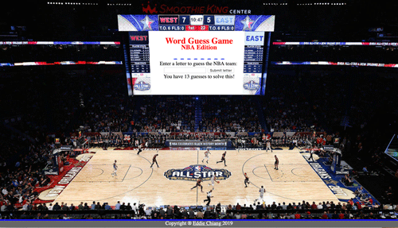

# NBA-themed Word Guess Game

This is the classic "Hangman" game in the spirit of the upcoming NBA All Star game.  The coding and logic of the game is built using JavaScript, with particular focus on variable generation, for loops, conditional logics, and dynamic display of letters and scores in html.

## App Interface
Instructions:
* Enter a letter and click submit to guess the NBA team.
* Wrong guesses will be tracked and displayed.
* You have a limited number of guesses to solve the game.

Click on the link!
https://echiang73.github.io/NBA-Team-Word-Guess/

## Built with
* HTML5
* CSS3
* JavaScript
* Digital-7 font using @font-face
* Media query for responsive web design

### Here is the preview of the web application:

